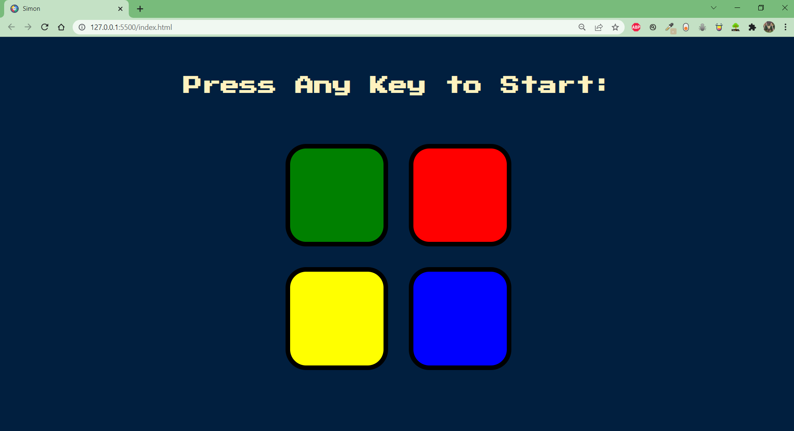
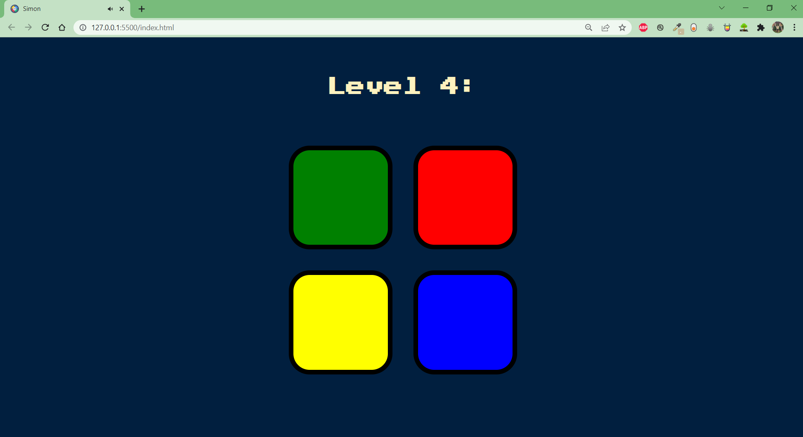
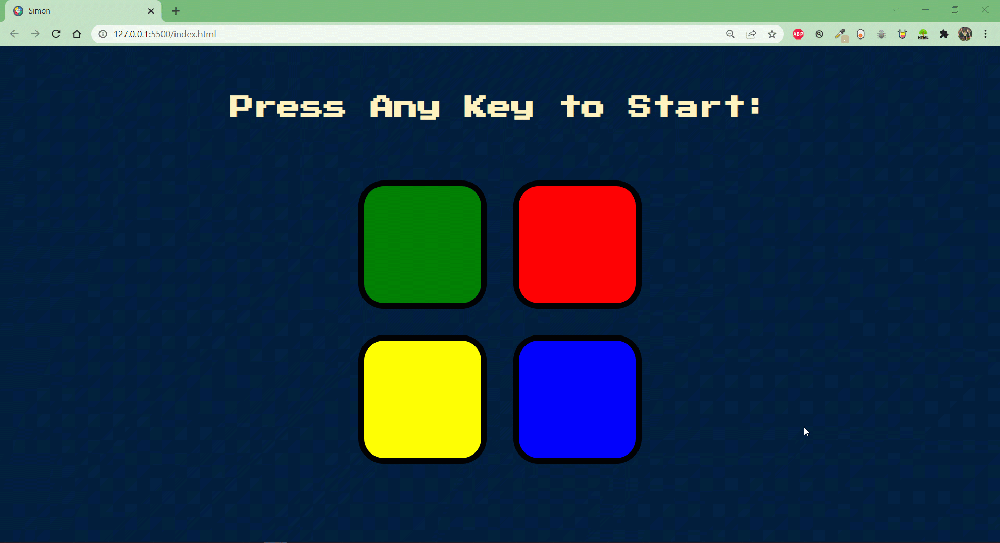

# Simon-Game-Web-Based-Project
Simon is an electronic game of memory skill. Our Website simulate this game by making a series of electric sound and the user should repeat this series correctly and then it gets more complex, once the user clicks a wrong pattern the app gives alert and restarts.

## First, when the application starts, it waits till the user press any button:

Once the user clicks any button it starts playing some series of sounds and showing up the current level.

when the user couldn't make the right sequence it gives alert and Restarts.

### Here is a game play of the Application:

<strong><em>Give a yourself a try from the link below:</em></strong>

<a href="https://abdelrahmanhassan1.github.io/Simon-Game-Web-Based-Project/" >Simon Game</a>